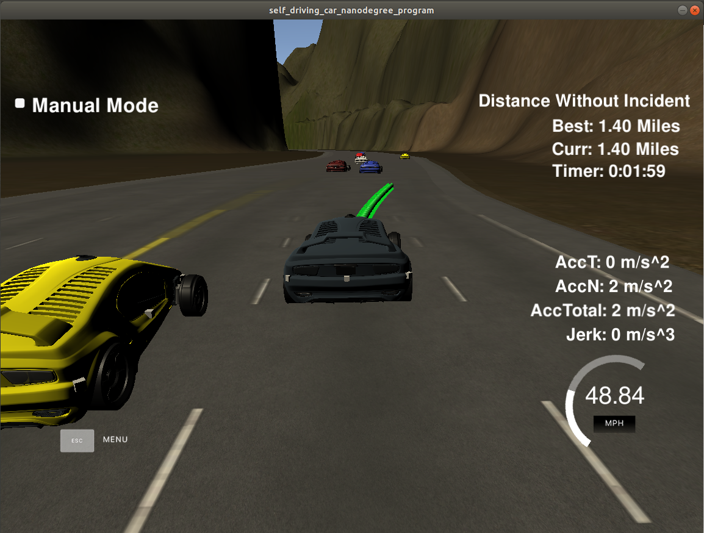
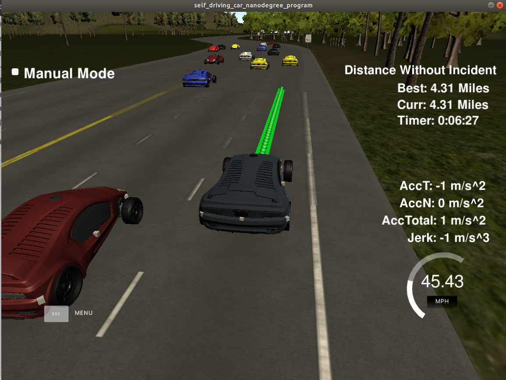

# Autonomous Vehicle Path Planner
 
### Goals
In this project, a car safely navigates around a virtual highway with other traffic that is driving +-10 MPH of the 50 MPH speed limit. The car should try to go as close as possible to the 50 MPH speed limit, which means passing slower traffic when possible. The car should avoid incidents (collisions, speed up above the maximum speed, driving inside of the marked road lanes at all times). Also the car should not experience total acceleration over 10 m/s^2 and jerk that is greater than 10 m/s^3. The car will have the sensor fusion data provided by the sensors that helps to analyze the other vehicles position and velocity and that information is processed to make decision during the driving.

## Dependencies

* cmake >= 3.5
  * All OSes: [click here for installation instructions](https://cmake.org/install/)
* make >= 4.1
  * Linux: make is installed by default on most Linux distros
  * Mac: [install Xcode command line tools to get make](https://developer.apple.com/xcode/features/)
  * Windows: [Click here for installation instructions](http://gnuwin32.sourceforge.net/packages/make.htm)
* gcc/g++ >= 5.4
  * Linux: gcc / g++ is installed by default on most Linux distros
  * Mac: same deal as make - [install Xcode command line tools]((https://developer.apple.com/xcode/features/)
  * Windows: recommend using [MinGW](http://www.mingw.org/)
* [uWebSockets](https://github.com/uWebSockets/uWebSockets)
  * Run either `install-mac.sh` or `install-ubuntu.sh`.
  * If you install from source, checkout to commit `e94b6e1`, i.e.
    ```
    git clone https://github.com/uWebSockets/uWebSockets 
    cd uWebSockets
    git checkout e94b6e1
    ```
### Simulator.
There is a simulator that provide the functionality to drive the car around a track using the trajectories provided by the path planner. It can be downloaded from  [releases tab (https://github.com/udacity/self-driving-car-sim/releases/tag/T3_v1.2).

## Basic Build Instructions

1. Clone this repo.
2. Make a build directory: `mkdir build && cd build`
3. Compile: `cmake .. && make`
4. Run it: `./path_planning`.
5. Run the simulator and unselect "Manual mode" box.

  

## Details

1. The car uses a perfect controller and will visit every (x,y) point it recieves in the list every .02 seconds. The units for the (x,y) points are in meters and the spacing of the points determines the speed of the car. The vector going from a point to the next point in the list dictates the angle of the car. Acceleration both in the tangential and normal directions is measured along with the jerk, the rate of change of total Acceleration. The (x,y) point paths that the planner recieves should not have a total acceleration that goes over 10 m/s^2, also the jerk should not go over 50 m/s^3. (NOTE: As this is BETA, these requirements might change. Also currently jerk is over a .02 second interval, it would probably be better to average total acceleration over 1 second and measure jerk from that.

2. There will be some latency between the simulator running and the path planner returning a path, with optimized code usually its not very long maybe just 1-3 time steps. During this delay the simulator will continue using points that it was last given, because of this its a good idea to store the last points you have used so you can have a smooth transition. previous_path_x, and previous_path_y can be helpful for this transition since they show the last points given to the simulator controller with the processed points already removed. You would either return a path that extends this previous path or make sure to create a new path that has a smooth transition with this last path.

## Tips

A really helpful resource for doing this project and creating smooth trajectories was using http://kluge.in-chemnitz.de/opensource/spline/.

### The Code and Model

1. BehaviorPlanner::sensor_fusion_data_analize(): this function analyzes the data provided from sensors. It read the information provided of each car detected by the sensors. It evaluates the car's position, checking the lane (d position) in which the car is driving and if there is a short distance (s position difference) between the cars; it could be car ahead or behind the autonomous car, because we want to check if there is enough distance between cars before changing the current lane. In this case, a gap of 30m is checked to determine if a car is near, it's that the case the function will return a true indicating that for that specific lane there is car near and that there is not enough gap to perform a lane change.
2. BehaviorPlanner::decision_take: do the next action of the car. If there is not a car ahead in our current lane, then the car should go as fast as it can (50 mph) and it should keep the lane. If there is car ahead and in the same lane, the first we should to do is to speed down to avoid a collision. Then, it is verified if there is a car in the other lane(s); if there is not a car or it is not close (greater than 30m), then a lane change is done. Otherwise, the car should speed down waiting for an opportunity to change the lane.
3. The new trajectory is calculated and it is passed to the simulator. The previous trajectory is used to calculate the next one to avoid having abrupt lane changes.


